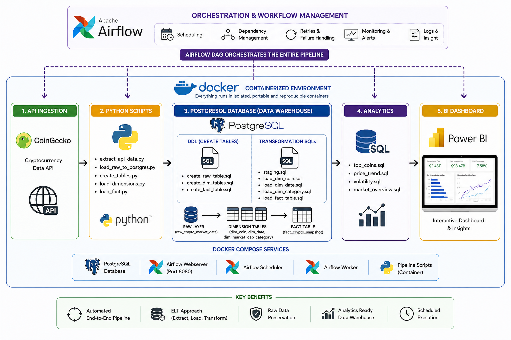
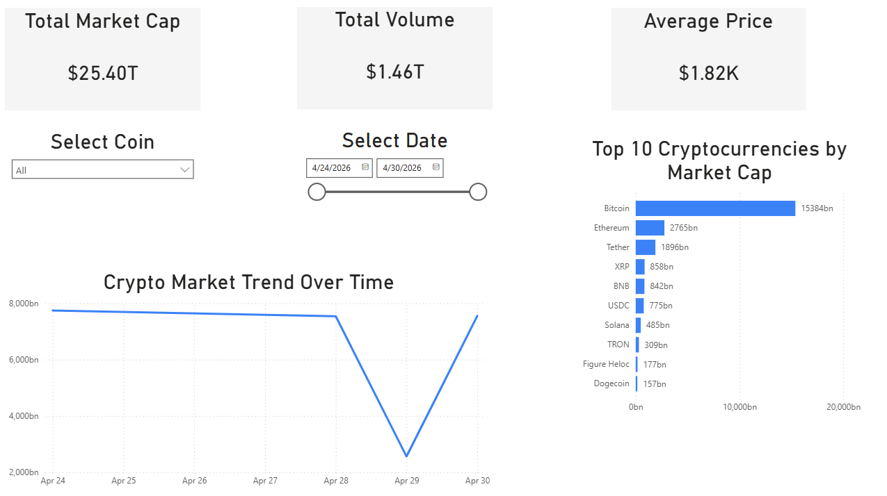
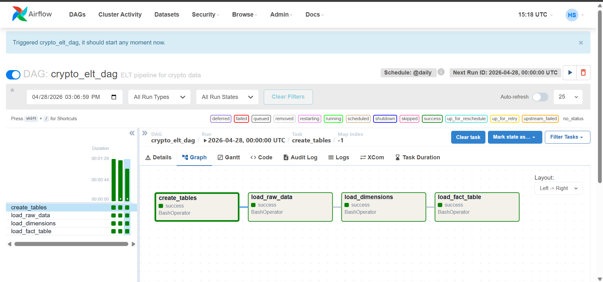
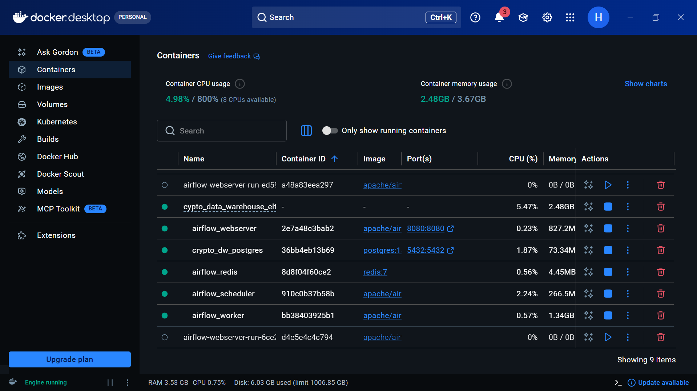

# Crypto Data Warehouse ELT Pipeline
---

---

## Project Overview

An end-to-end Data Engineering project that builds a complete ELT pipeline, data warehouse, orchestration system, and BI dashboard using real cryptocurrency market data.

This project focuses on moving from ETL to ELT by first loading raw cryptocurrency market data into postgres database to perfom the transformation of raw API data into a fully structured analytics system using modern data engineering practices.

It follows an ELT (Extract → Load → Transform) approach where:
Raw data is first loaded into the database
Transformations are performed inside the warehouse
Data is modeled into a Star Schema for analytics

## Problem Statement

APIs like CoinGecko provide real-time crypto data, but
Data is unstructured and not analytics-ready,
No historical tracking by default,
Difficult to perform consistent reporting,
No centralized data warehouse

## Solution Architecture

```
CoinGecko API
      ↓
Python Extraction
      ↓
Raw JSON Backup
      ↓
PostgreSQL (Raw Layer)
      ↓
SQL Transformations (ELT)
      ↓
Star Schema (Warehouse)
      ↓
Airflow Orchestration
      ↓
Power BI Dashboard

```

## Data Warehouse Design(Star Schema)

### Fact Table
1. fact_crypto_snapshot
- coin_key
- date_key
- category_key
- current_price
- market_cap
- total_volume
- snapshot_timestamp

### Dimension Tables
1. dim_coin
- coin_key
- coin_id
- coin_name
- symbol

2. dim_date
- date_key
- full_date

3. dim_market_cap_category
- category_key
- market_cap_category

## Screenshots

### Power BI Dashboard



---

### Apache Airflow DAG Graph



---

### Docker Services 



---

## Tech Stack
1. Python
2. PostgreSQL
3. SQLAlchemy
4. Docker
5. Apache Airflow
6. Microsoft Power BI Desktop
7. Logging
8. python-dotenv

## Project Structure
---

```
crypto_data_warehouse_elt/
│
├── dags/
│   └── crypto_elt_dag.py
│
├── scripts/
│   ├── utils.py
│   ├── extract_api_data.py
│   ├── load_raw_to_postgres.py
│   ├── create_tables.py
│   ├── load_dimensions.py
│   └── load_fact.py
│
├── sql/
│   ├── ddl/
│   └── transformations/
│    └── analytics/
│
├── dahboard/
│   └── Data Warehouse Analytics.pbix
│
├── images/
│   
│
├── data/
├── logs/
├── docker-compose.yml
├── requirements.txt
└── README.md

```

## Pipeline Workflow (Airflow DAG)

The pipeline is automated using Airflow DAG containing:
- Create tables (DDL)
- Load raw data from API script
- Load dimension tables script
- Load fact table script

## Docker Setup

- The system runs using Docker:
- PostgreSQL container (data warehouse)
- Airflow containers (scheduler + webserver)
- Pipeline container

## How to Run

1. Start services
docker-compose up --build

2. Access Airflow UI
Access Airflow UI

3. Trigger DAG
Enable DAG
Run pipeline

## Dashboard (Power BI)

The Power BI dashboard provides:
- KPI cards (market cap, volume)
- Top 10 cryptocurrencies
- Market trend over time
- Interactive filtering (coin + date)

## Key Features
- ELT pipeline architecture
- Star schema data modeling
- Automated workflow with Airflow
- Containerized environment with Docker
- Interactive BI dashboard

## Future Improvements
- Add dbt for transformation management
- Deploy to cloud (AWS/GCP)
- Implement real-time streaming pipeline
- Add data quality checks

## Learning Outcomes

- This project demonstrates:
- End-to-end data engineering workflow
- Data warehouse design principles
- ELT vs ETL approach
- Workflow orchestration
- BI integration